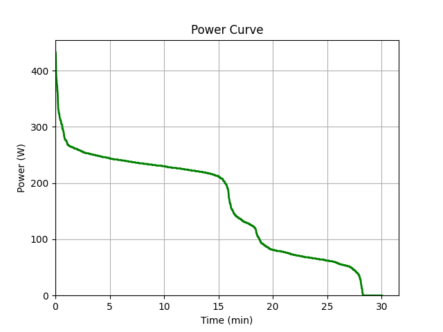

# Excercises for the course Programming 2
These excercices were completed by:
-Gabriel Schwarz
-Pia Schratt

##Excercise 1
### Dieses Projekt visualisiert eine einfache Leistungskurve auf Basis gegebener Daten
Ausführung:
1. Das Repository von Github clonen
2. in VS Code pdm install im Terminal aufrufen
3. File power_curve ausführen

Funktion: Funktionen werden importiert --> time wird kumulativ und individuell bestimmt --> Daten werden eingelesen --> Graph wird mit matplotlib erstellt
                                                                                                       Show the plot: 